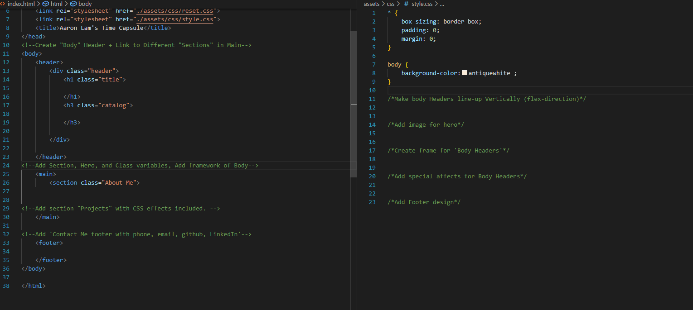
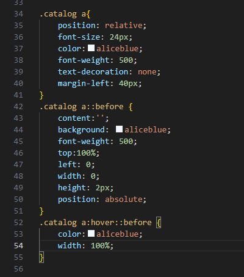
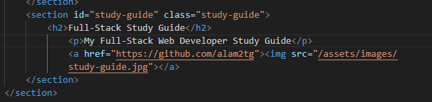

# alamtimecapsule
Collection of my projects after starting my journey as a developer
https://alam2tg.github.io/alamtimecapsule/

## Description

This website will act as my landing page as the start of my coding career.
I built this project to tell people a little about myself, and how I ended up on the career path of a developer.
As I grow as a developer, this website will be a timeline of my projects, connecting people to my future web creations throughout my journey.
Making this website taught me the technical skills of designing a website, while also making it device-friendly through flexboxes. On-top of that, I also had to think about the projects I am inspired to make, giving me a road-map towards my future endeavors.

## Installation
1. Create a framework in HTML and CSS

2. Fill details in HTML/CSS

3. Add CSS styling while observing live-website

4. Add URLs to Images

5. Add flex capabilities to code

## Credits
Chris Coyier's - "A Complete Guide to Flexbox"
https://css-tricks.com/snippets/css/a-guide-to-flexbox/